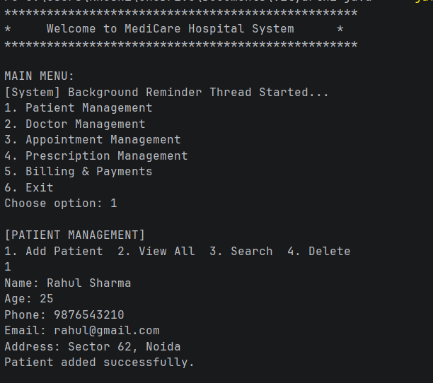
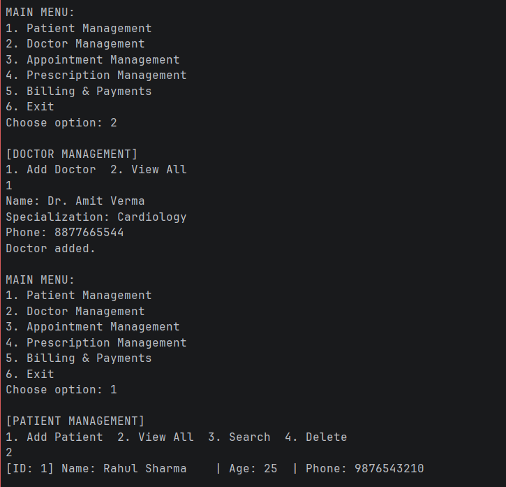
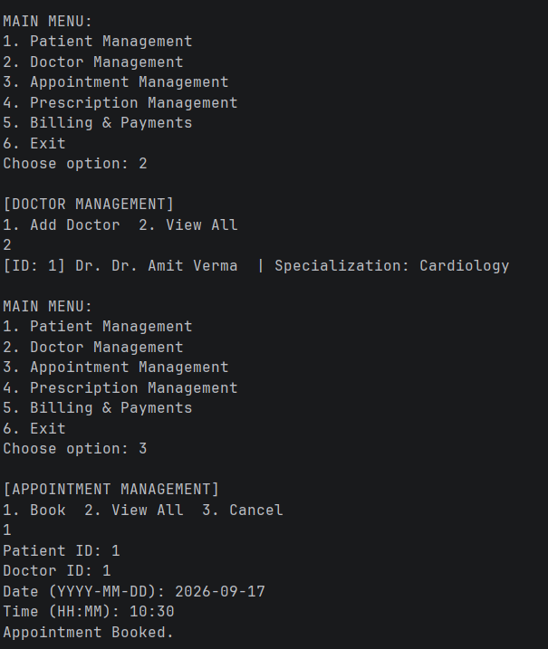
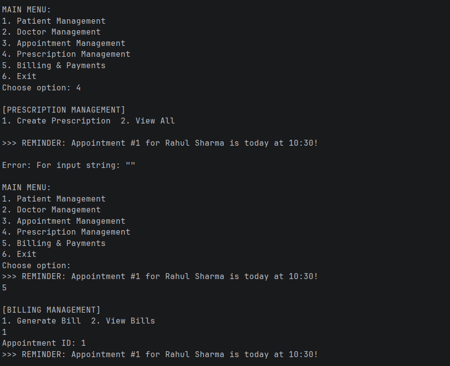
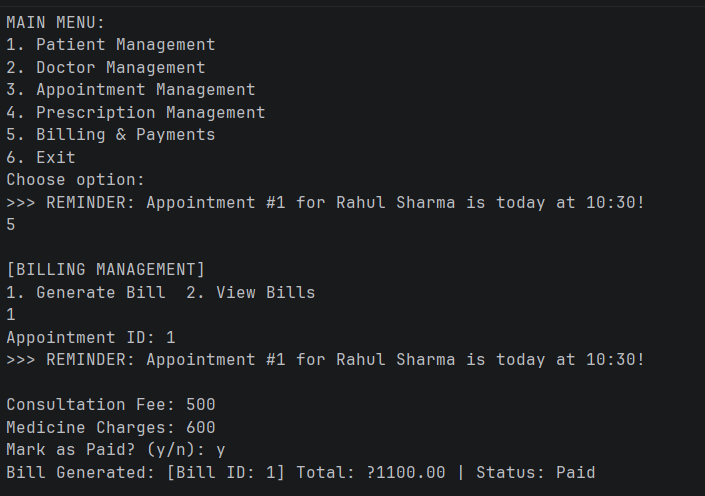

# MediCare – Hospital & Clinic Management System

## 1. Project Title

**MediCare – Hospital & Clinic Management System**

---

## 2. Overview of the Project

MediCare is a Java-based Hospital and Clinic Management System developed to manage essential healthcare activities in a simple and organized way.

The project allows users to manage **patients, doctors, appointments, prescriptions, and billing** through a terminal-based interface.

It also includes input validation, appointment conflict checking, automatic bill calculation, and an appointment reminder system using Java multithreading.

The entire project is implemented in a **single Java file (`MediCare.java`)** for simplicity and easy execution.

---

## 3. Features

### Patient Management

* Add new patients
* View patient records
* Search patients
* Update patient information
* Delete patient records

### Doctor Management

* Add doctors
* View doctor records
* Search doctors
* Update doctor information
* Delete doctor records

### Appointment Management

* Book appointments
* View appointments
* Search appointments
* Cancel appointments
* Reschedule appointments
* Check doctor availability
* Prevent double-booking of doctors

### Prescription Management

* Create prescriptions
* Add multiple medicines
* Store diagnosis details
* View prescription history

### Billing Management

* Generate bills
* Calculate consultation charges
* Calculate medicine charges
* Calculate total bill amount
* Manage payment status

### Appointment Reminder

* Runs a background reminder using Java `Thread`/`Runnable`
* Checks upcoming appointments
* Generates reminders for approaching appointments

### Input Validation

* Validate required fields
* Validate phone numbers
* Validate email addresses
* Validate numeric values
* Validate appointment conflicts
* Handle invalid input safely

---

## 4. Technologies / Tools Used

### Technology

* **Java**

### Tools

* **JDK (Java Development Kit)**
* **Command Line / Terminal**
* **Git & GitHub** for version control and project submission

### Java Concepts Used

* Object-Oriented Programming
* Classes and Objects
* Encapsulation
* Inheritance
* Abstraction
* Polymorphism
* Interfaces
* ArrayList
* HashMap
* Exception Handling
* Regular Expressions
* Multithreading
* Synchronization
* Singleton Pattern

---

## 5. Installation & Run Instructions

### Prerequisites

Install **JDK** on your computer.

Check whether Java is installed:

```bash
java -version
```

Check the Java compiler:

```bash
javac -version
```

### Step 1: Download or Clone the Project

Download the project from GitHub or clone the repository using:

```bash
git clone <repository-url>
```

Then open the project directory:

```bash
cd <project-folder>
```

### Step 2: Compile the Java File

The project contains a single source file:

```text
MediCare.java
```

Compile it using:

```bash
javac MediCare.java
```

### Step 3: Run the Project

After successful compilation, run:

```bash
java MediCare
```

The MediCare main menu will appear in the terminal.

### Example

```text
========================================
             MEDICARE
   Hospital & Clinic Management System
========================================

1. Patient Management
2. Doctor Management
3. Appointment Management
4. Prescription Management
5. Billing Management
6. Exit

Enter your choice:
```

---

## 6. Testing Instructions

The project can be tested directly through the terminal.

### Patient Management Testing

1. Select **Patient Management**.
2. Add a new patient.
3. View the patient list.
4. Search for the patient.
5. Update patient details.
6. Delete the patient.
7. Verify that each operation works correctly.

### Doctor Management Testing

1. Select **Doctor Management**.
2. Add a doctor.
3. View doctor records.
4. Search for the doctor.
5. Update doctor information.
6. Delete the doctor.

### Appointment Testing

1. Add at least one patient and doctor.
2. Create an appointment.
3. View the appointment.
4. Try booking another appointment for the **same doctor, date, and time**.
5. Verify that the system prevents double-booking.
6. Test cancellation.
7. Test rescheduling.

### Prescription Testing

1. Create or select a completed appointment.
2. Create a prescription.
3. Enter diagnosis details.
4. Add multiple medicines.
5. Save the prescription.
6. View prescription history.

### Billing Testing

1. Select an appropriate appointment.
2. Enter the consultation fee.
3. Add medicine charges.
4. Generate the bill.
5. Verify that the total amount is calculated correctly.
6. Test the payment status.

### Validation Testing

Test the application with:

* Empty fields
* Invalid phone numbers
* Invalid email addresses
* Invalid numeric values
* Negative billing amounts
* Invalid patient/doctor IDs
* Conflicting appointments

The system should display an appropriate error message instead of crashing.

### Appointment Reminder Testing

1. Create an upcoming appointment.
2. Start the application.
3. Allow the reminder thread to run.
4. Verify that the system detects upcoming appointments and generates a reminder.

---

## 7. Screenshots
## Screenshots

### Screenshot 1


### Screenshot 2


### Screenshot 3


### Screenshot 4


### Screenshot 5



## Project Execution

```text
Compile:
javac MediCare.java

Run:
java MediCare
```

---

## Project Type

**Academic Project – Programming in Java**

**Implementation:** Java
**Interface:** Terminal-based
**Source Files:** Single Java file
